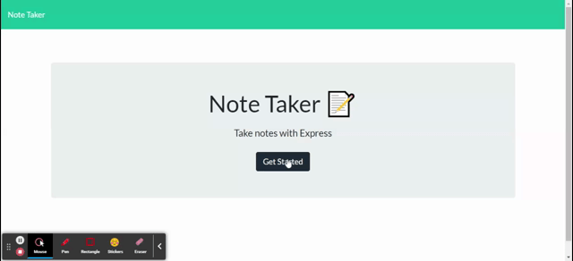

# 11 Express.js: Note Taker

## User Story

```
AS A small business owner
I WANT to be able to write and save notes
SO THAT I can organize my thoughts and keep track of tasks I need to complete
```


## Acceptance Criteria

```
GIVEN a note-taking application
WHEN the user opens the Note Taker
THEN the user is presented with a landing page with a link to a notes page
WHEN clicked on the link to the notes page
THEN the user is presented with a page with existing notes listed in the left-hand column, plus empty fields to enter a new note title and the note’s text in the right-hand column
WHEN the user enters a new note title and the note’s text
THEN a Save icon appears in the navigation at the top of the page
WHEN the user clicks on the Save icon
THEN the new note the user has entered is saved and appears in the left-hand column with the other existing notes
WHEN the user clicks on an existing note in the list in the left-hand column
THEN that note appears in the right-hand column
WHEN the user clicks on the Write icon in the navigation at the top of the page
THEN the user is presented with empty fields to enter a new note title and the note’s text in the right-hand column
```


## Mock-Up

The following images show the web application's appearance and functionality: 




## Bonus

* The DELETE route has been added to the application and is functioning.


## Review

You are required to submit BOTH of the following for review:

* The URL of the functional, deployed application: https://note-taker-zahid.herokuapp.com/

* The URL of the GitHub repository: https://github.com/zahid267/Note_Taker

- - -
© Developed by Muhammad Zahid - May 07, 2021.